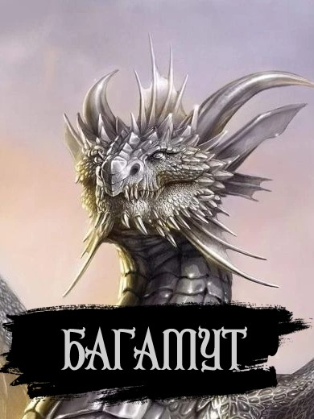

**Портрет:** 

## Предыстория

Багамут — платиновый дракон и правитель Клертона, столицы сил света в материальном плане. Вместе с Тиамат подговорил Маммона уничтожить Сигмайера из зависти к его статусу. Раскрыл договор дома Уол с драконами, что привело к войне против рода Уол и Келимдоу. Возвёл огромные горы, чтобы остановить распространение проклятия Келимдоу. Хору — самая высокая гора, ставшая священным местом паломничества приверженцев Багамута.
